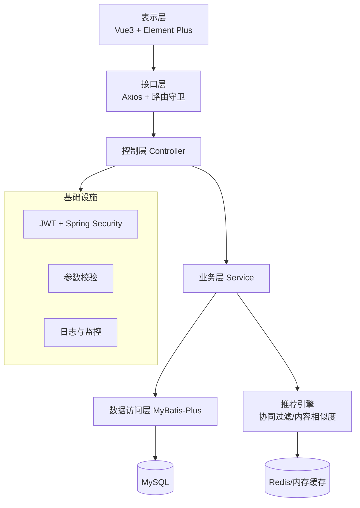
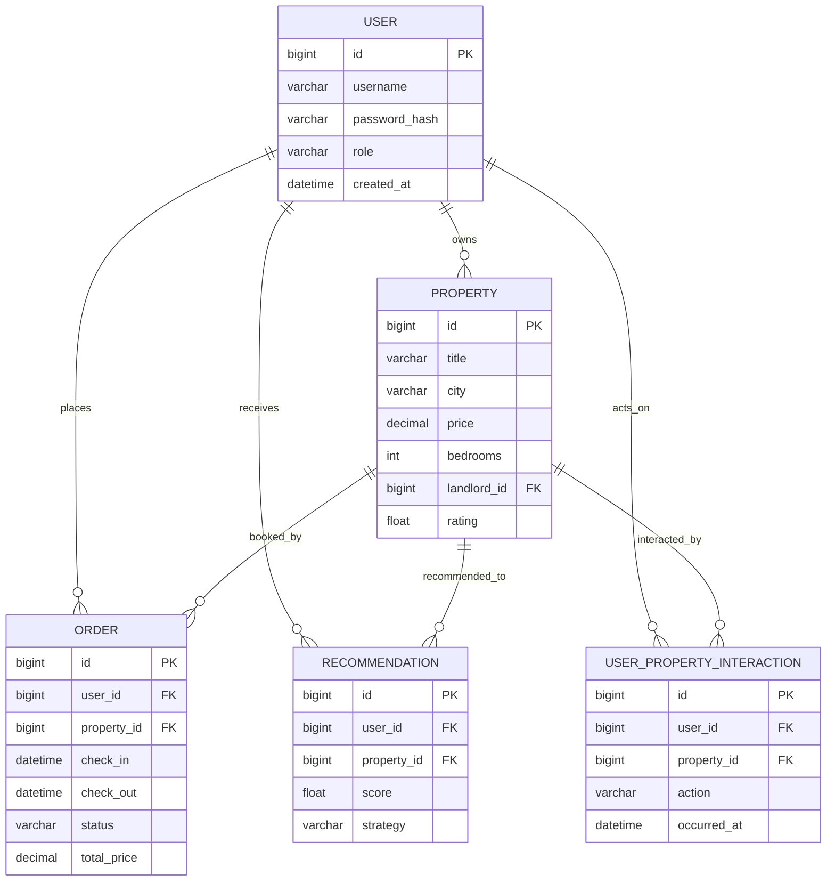
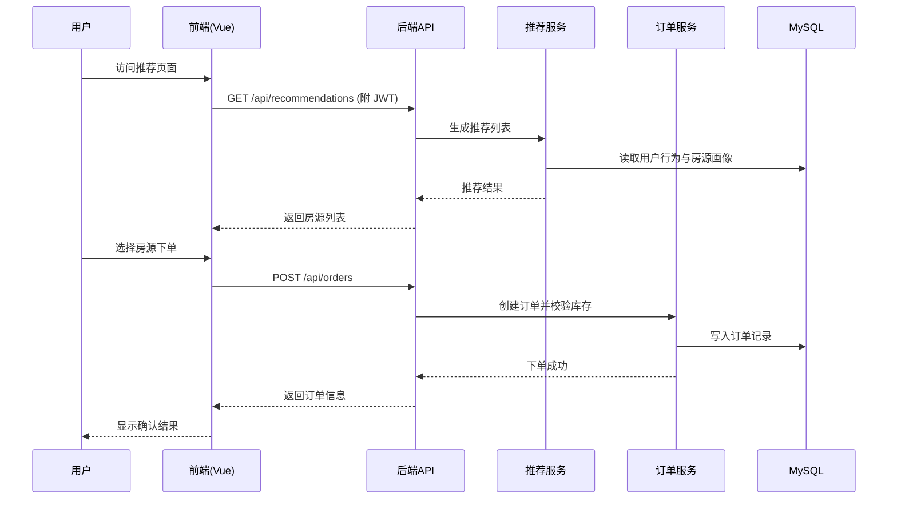

# 民宿推荐系统毕业设计论文

## 摘要

本论文围绕“民宿推荐系统”的设计与实现展开，系统采用前后端分离架构，前端基于 Vue 3 + Vite + Element Plus，后端基于 Spring Boot、MyBatis-Plus 与协同过滤/内容相似度的混合推荐算法，为用户提供个性化房源推荐、在线预订及房东房源管理能力。论文重点介绍系统背景、需求分析、总体架构、关键技术、数据库设计、核心业务流程与功能实现，为同类推荐场景提供可复用的工程实践参考。

**关键词**：民宿推荐；个性化推荐；Spring Boot；Vue 3；混合推荐算法

---

## 目录

1. 引言  
2. 相关工作与关键技术  
3. 需求分析  
4. 总体设计  
5. 功能设计  
6. 数据库设计（ER 图）  
7. 核心流程设计（时序图）  
8. 系统实现与部署  
9. 测试与验证  
10. 结论与展望  

---

## 1. 引言

### 1.1 研究背景

近年来，民宿经济迅速发展，用户在海量房源中找到合适房源的成本不断升高；同时，房东也需要更精确地触达潜在客群。传统“搜索+筛选”模式难以满足个性化需求，推荐系统因而成为提升转化率与用户满意度的核心手段。本项目面向毕业设计实践，聚焦“用户—房源—交互行为”三元关系，综合协同过滤与内容特征，为用户提供实时、可解释的民宿推荐。

在工程层面，系统需具备可扩展、可维护、可观测的架构特性：前端需保证良好交互体验与响应式布局，后端需支持高并发下的鉴权、缓存与推荐计算，数据库需兼顾事务一致性与查询性能。此外，毕业论文要求对系统设计进行完整描述，包括 ER 图、时序图、系统/技术架构图，以及面向终端用户的功能说明书式说明。

### 1.2 研究目的

- 构建一套可运行的民宿推荐系统，实现用户注册登录、房源管理、订单预订与个性化推荐。  
- 设计清晰的系统与技术架构，明确各层职责与数据流动。  
- 通过 ER 图、时序图等模型化描述，提升系统的可理解性与可维护性。  

### 1.3 论文结构

论文依次介绍需求、总体设计、数据库与核心流程，随后给出实现、部署与测试结论，最后总结与展望。

---

## 2. 相关工作与关键技术

- **前端**：Vue 3、Vite、Element Plus、Pinia、Vue Router、Axios。  
- **后端**：Spring Boot、MyBatis-Plus、JWT 认证、Spring Validation、Lombok。  
- **推荐算法**：协同过滤（基于用户交互相似度）与内容相似度（房源标签、位置、价格、设施）混合加权。  
- **数据存储**：MySQL（事务型主库），可扩展 Redis 作为缓存/会话存储。  

---

## 3. 需求分析

- **用户端需求**：注册/登录、浏览/搜索/筛选房源、查看详情、在线预订、查看与取消订单、查看个性化推荐列表。  
- **房东端需求**：发布/编辑/删除房源，查看房源统计（浏览量、预订数、评分），管理订单。  
- **管理员需求**：用户管理、房源审核、统计报表。  
- **非功能性需求**：安全（JWT 鉴权、权限控制）、可用性（分页与缓存）、可扩展性（微服务化可演进）、可维护性（清晰分层）。  

---

## 4. 总体设计

### 4.1 系统架构图

```mermaid
flowchart LR
    subgraph Client[前端 SPA]
        UI[Vue3 + Element Plus]
        Router[Vue Router]
        Store[Pinia 状态]
    end

    subgraph Backend[后端服务]
        APIGW[Spring Boot API 网关/统一入口]
        Auth[认证与权限]
        Rec[推荐服务<br/>(协同过滤+内容)]
        Order[订单服务]
        Property[房源服务]
        UserSvc[用户服务]
    end

    DB[(MySQL)]:::db
    Cache[(Redis)]:::cache

    Client -->|Axios /api| APIGW
    APIGW --> Auth
    APIGW --> Rec
    APIGW --> Order
    APIGW --> Property
    APIGW --> UserSvc
    Auth --> DB
    Rec --> DB
    Order --> DB
    Property --> DB
    UserSvc --> DB
    Rec --> Cache
    classDef db fill:#f2f2ff,stroke:#6370f4;
    classDef cache fill:#fdf2e9,stroke:#e67e22;
```

### 4.2 技术架构图



---

## 5. 功能设计

- **用户管理**：注册、登录、JWT 鉴权、角色（USER/LANDLORD/ADMIN）权限控制。  
- **房源管理（房东）**：发布、编辑、删除房源，查看浏览量/预订量/评分。  
- **房源浏览与搜索**：分页、城市/价格/卧室数筛选，关键词搜索。  
- **房源详情**：图片轮播、设施展示、可用日历。  
- **订单管理**：创建订单、查看订单、取消待确认订单。  
- **推荐功能**：智能混合推荐（60% 协同过滤 + 40% 内容相似度），同时支持纯协同过滤与纯内容推荐列表。  

> 界面操作示意：可在此处放置前端“用户管理/房源管理/推荐结果”截图（例如 `frontend` 构建后页面截图），作为用户使用说明书式的配图。

---

## 6. 数据库设计（ER 图）



---

## 7. 核心流程设计（时序图）

以“用户查看推荐并下单”为例：



---

## 8. 系统实现与部署

- **前端**：`cd frontend && npm install && npm run build`，产物位于 `frontend/dist`。  
- **后端**：`mvn spring-boot:run` 或打包后执行 `java -jar target/*.jar`。  
- **环境依赖**：MySQL 8.x（初始化数据库可使用 `sql/` 下的脚本），可选 Redis 作为缓存层。  
- **配置要点**：在 `application.yml` 配置数据库、JWT 密钥与跨域；在 `frontend/vite.config.js` 设置 API 代理指向后端。  

---

## 9. 测试与验证

- **功能测试**：用户注册登录、房源发布与编辑、搜索/筛选、下单/取消、推荐列表展示。  
- **接口测试**：通过 Postman/Rest Client 验证主要 API（认证、房源、订单、推荐）。  
- **性能与可靠性**：可使用 JMeter 对推荐与下单接口进行并发压测；监控数据库慢查询与缓存命中率。  

---

## 10. 结论与展望

本文实现了一套基于混合推荐算法的民宿推荐系统，完成了从需求分析、架构设计到实现与验证的完整过程。未来可进一步：  
1) 引入实时特征与在线学习，提升推荐时效性；  
2) 增加地理位置与出行偏好等多模态特征，优化召回与排序；  
3) 部署 A/B 测试体系，量化评估推荐效果；  
4) 微服务化拆分与容器编排，提升弹性与可维护性。  
