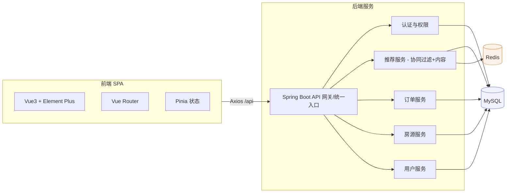
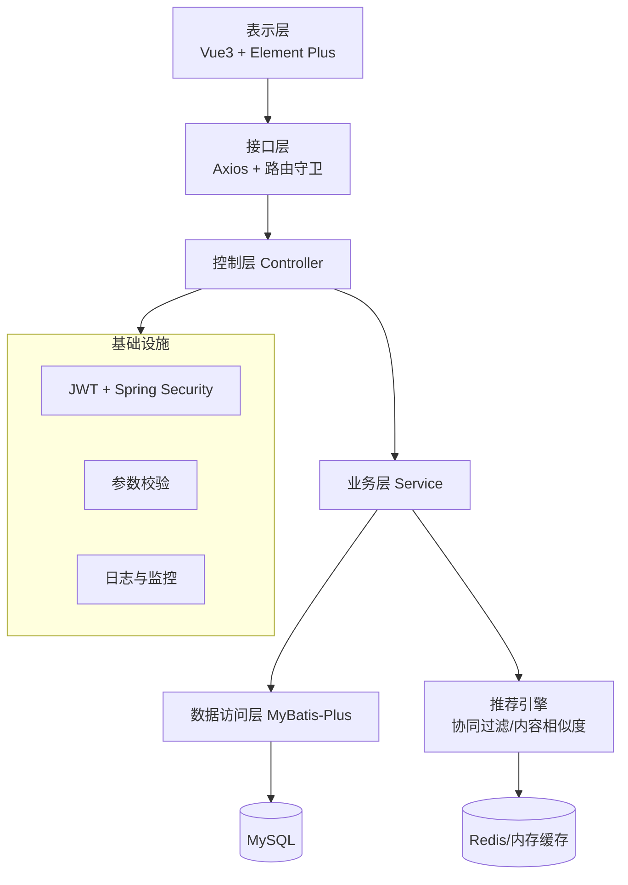
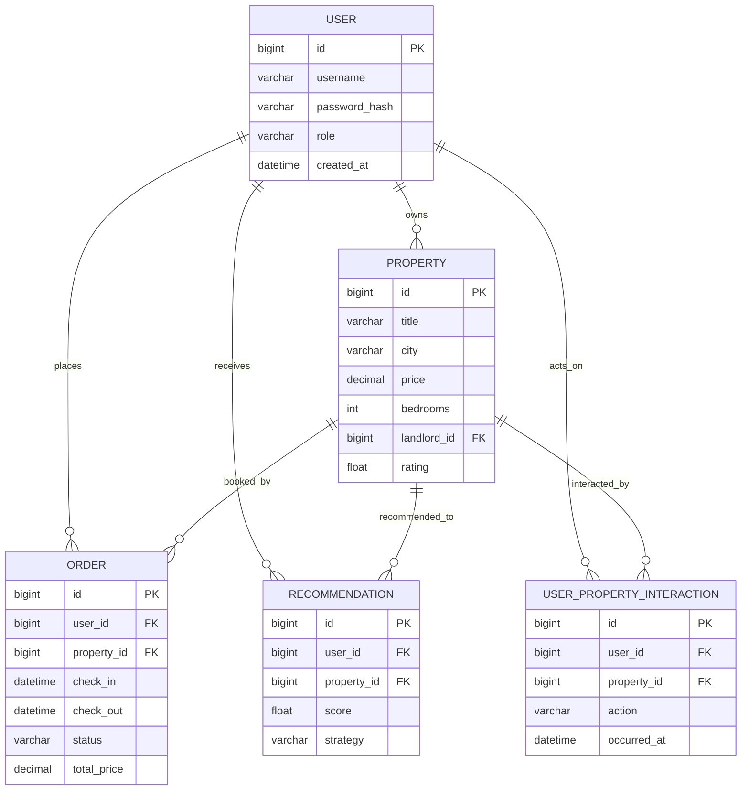
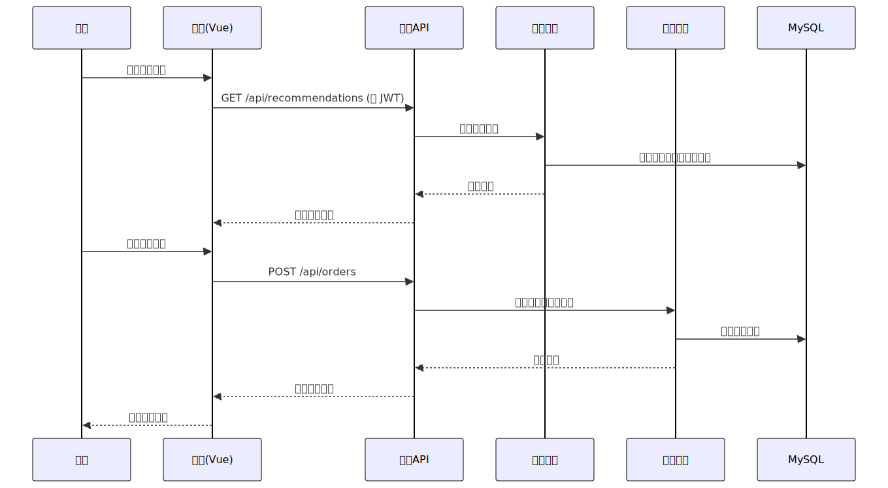
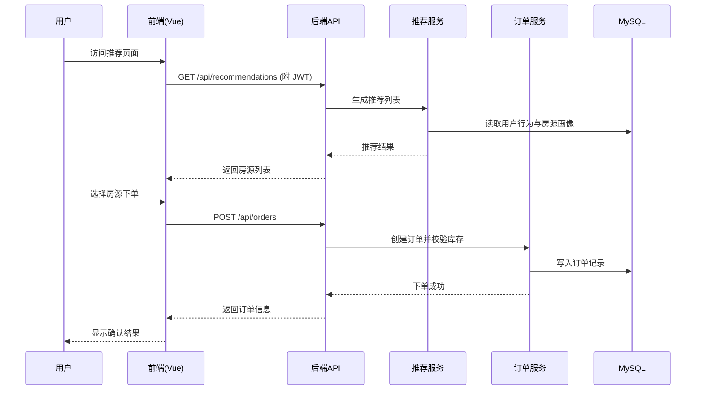

# 民宿推荐系统毕业设计论文

> 着不是论文，只是我的一个空闲构思。

**作者**：XXX（本科毕业设计）  
**学院**：XXX学院  专业：XXX  学号：XXXXXXXX  
**指导教师**：XXX  职称：XXX  
**提交日期**：2026 年 X 月 X 日

---

## 摘要

本论文围绕“民宿推荐系统”的设计与实现展开，系统采用前后端分离架构，前端基于 Vue 3 + Vite + Element Plus，后端基于 Spring Boot、MyBatis-Plus 与协同过滤/内容相似度的混合推荐算法，为用户提供个性化房源推荐、在线预订及房东房源管理能力。论文重点介绍系统背景、需求分析、总体架构、关键技术、数据库设计、核心业务流程与功能实现，为同类推荐场景提供可复用的工程实践参考。

**关键词**：民宿推荐；个性化推荐；Spring Boot；Vue 3；混合推荐算法

---

## Abstract

This thesis presents the design and implementation of a homestay recommendation system. The frontend is built with Vue 3, Vite, and Element Plus, while the backend leverages Spring Boot and MyBatis-Plus, combining collaborative filtering and content-based recommendation to provide personalized listings, online booking, and host property management. The work covers background, requirement analysis, system architecture, key technologies, database and process design, implementation, and testing.

**Keywords**: Homestay recommendation; Personalized recommendation; Spring Boot; Vue 3; Hybrid recommender

---

## 目录

1. 引言  
2. 相关工作与关键技术  
3. 需求分析  
4. 总体设计  
5. 功能设计  
6. 数据库设计（ER 图）  
7. 核心流程设计（时序图）  
8. 系统实现与部署  
9. 测试与验证  
10. 结论与展望  
11. 参考文献  
12. 致谢  

---

## 1. 引言

### 1.1 研究背景

近年来，民宿经济迅速发展，用户在海量房源中找到合适房源的成本不断升高；同时，房东也需要更精确地触达潜在客群。传统“搜索+筛选”模式难以满足个性化需求，推荐系统因而成为提升转化率与用户满意度的核心手段。本项目面向毕业设计实践，聚焦“用户—房源—交互行为”三元关系，综合协同过滤与内容特征，为用户提供实时、可解释的民宿推荐。

在工程层面，系统需具备可扩展、可维护、可观测的架构特性：前端需保证良好交互体验与响应式布局，后端需支持高并发下的鉴权、缓存与推荐计算，数据库需兼顾事务一致性与查询性能。此外，毕业论文要求对系统设计进行完整描述，包括 ER 图、时序图、系统/技术架构图，以及面向终端用户的功能说明书式说明。

随着“旅游+互联网”业态的深化，用户决策路径更加依赖移动端信息流与个性化推荐。海量房源与多维偏好（价格、地理位置、设施、评论、时效性）叠加，使得简单排序无法覆盖长尾需求，个性化推荐成为提升点击率、转化率与复购率的关键抓手。同时，房东侧也希望通过精准推荐触达潜在客户，提高房源曝光与收益。在此背景下，本系统旨在提供工程可落地、算法可扩展的毕业设计实践，为后续研究与产品化奠定基础。

另一方面，国内外在线短租平台（如 Airbnb、途家、小猪、飞猪等）在快速发展中，普遍面临“信息过载”和“体验分层”问题：一方面大量房源涌入，用户难以在限定时间内完成决策；另一方面房源质量、评论体系、价格波动、地理位置与交通可达性等多维因素交织，增加了用户筛选成本。推荐系统通过建模用户兴趣演化、上下文场景与房源画像，可以有效缩短决策路径，提高下单转化与留存。同时，平台需要兼顾公平性与多样性，避免热门房源的马太效应导致长尾房源曝光不足。因此，在推荐策略上需要在准确率、覆盖率、多样性和可解释性之间取得平衡。

学术与工业界对推荐系统的研究从经典协同过滤逐步演进到深度学习、图神经网络与强化学习等更复杂的框架，但在工程实践中，轻量、可解释、可快速迭代的方案依旧具有价值，尤其适用于中小规模平台或毕业设计项目。本项目采用“协同过滤 + 内容相似度”的混合方案，既利用用户行为相似性，又结合房源属性特征，兼顾冷启动与数据稀疏场景。此外，考虑到实际部署中的成本与可维护性，系统设计强调模块化分层、缓存与分页优化、JWT 鉴权与接口幂等处理，确保在有限资源下仍能稳定运行。

在数据安全与隐私层面，用户行为数据属于敏感信息，系统需保证传输加密、访问控制和最小化暴露；在性能层面，需要通过分页、索引、缓存与热点数据预取等手段，降低数据库压力并改善响应时间。在运维与监控层面，建议配合日志与指标采集（如接口耗时、QPS、错误率、慢查询、缓存命中率），为后续迭代与性能调优提供依据。综上，民宿推荐系统的研究背景既包含业务动因，也涵盖算法选择、工程实现、安全与运维等多维考量，构成本毕业设计的整体基础。

### 1.2 研究目的

- 构建一套可运行的民宿推荐系统，实现用户注册登录、房源管理、订单预订与个性化推荐。  
- 设计清晰的系统与技术架构，明确各层职责与数据流动。  
- 通过 ER 图、时序图等模型化描述，提升系统的可理解性与可维护性。  

### 1.3 论文结构

论文依次介绍需求、总体设计、数据库与核心流程，随后给出实现、部署与测试结论，最后总结与展望。

---

## 2. 相关工作与关键技术

- **前端**：Vue 3、Vite、Element Plus、Pinia、Vue Router、Axios。  
- **后端**：Spring Boot、MyBatis-Plus、JWT 认证、Spring Validation、Lombok。  
- **推荐算法**：协同过滤（基于用户交互相似度）与内容相似度（房源标签、位置、价格、设施）混合加权。  
- **数据存储**：MySQL（事务型主库），可扩展 Redis 作为缓存/会话存储。  

---

## 3. 需求分析

- **用户端需求**：注册/登录、浏览/搜索/筛选房源、查看详情、在线预订、查看与取消订单、查看个性化推荐列表。  
- **房东端需求**：发布/编辑/删除房源，查看房源统计（浏览量、预订数、评分），管理订单。  
- **管理员需求**：用户管理、房源审核、统计报表。  
- **非功能性需求**：安全（JWT 鉴权、权限控制）、可用性（分页与缓存）、可扩展性（微服务化可演进）、可维护性（清晰分层）。  

### 3.1 业务场景与用例

- **游客/用户**：搜索与筛选房源，查看图片与设施，获取推荐列表，提交预订与取消待确认订单。  
- **房东**：发布房源、管理库存与价格，查看数据统计（浏览、预订、评分），响应订单。  
- **管理员**：审核房源与用户，监控数据指标，导出报表。  

### 3.2 约束与假设

- JWT 作为主要鉴权手段，前端需持久化 Token；  
- 推荐算法以历史行为（浏览、收藏、下单）与房源画像为核心特征，冷启动可采用热门/地理位置近似回退；  
- 并发场景下订单创建需要事务与库存校验，必要时可引入行级锁与幂等性设计；  
- 未来可扩展到微服务架构，但当前以单体/模块化分层实现，兼顾毕业设计交付周期。  

### 3.3 风险与对策

- **冷启动风险**：新用户/新房源缺少行为数据，可采用热门房源、地理位置近似或内容相似度做回退，并逐步累积行为特征。  
- **数据稀疏与偏差**：协同过滤在稀疏矩阵下效果下降，可通过内容特征增强或加权融合；对热门房源的马太效应可加入多样性约束。  
- **并发与一致性**：下单环节需保证库存扣减与订单写入的原子性，可通过数据库事务、行级锁和唯一约束防重；必要时增加幂等 token。  
- **隐私与安全**：登录态必须通过 HTTPS 传输，Token 加签并设置合理过期；敏感字段不落前端；接口需防止越权访问。  

---

## 4. 总体设计

### 4.1 系统架构图

### 4.2 技术架构图

---

## 5. 功能设计

- **用户管理**：注册、登录、JWT 鉴权、角色（USER/LANDLORD/ADMIN）权限控制。  
- **房源管理（房东）**：发布、编辑、删除房源，查看浏览量/预订量/评分。  
- **房源浏览与搜索**：分页、城市/价格/卧室数筛选，关键词搜索。  
- **房源详情**：图片轮播、设施展示、可用日历。  
- **订单管理**：创建订单、查看订单、取消待确认订单。  
- **推荐功能**：智能混合推荐（60% 协同过滤 + 40% 内容相似度），同时支持纯协同过滤与纯内容推荐列表。  

> 界面操作示意：可在此处放置前端“用户管理/房源管理/推荐结果”截图（例如 `frontend` 构建后页面截图），作为用户使用说明书式的配图。

### 5.1 角色与权限说明

- **普通用户（USER）**：浏览/搜索房源、查看详情、下单、查看与取消订单、查看推荐列表。  
- **房东（LANDLORD）**：拥有普通用户权限，新增发布/编辑/删除房源，查看房源统计。  
- **管理员（ADMIN）**：拥有全部权限，可进行用户与房源审核、数据监管与报表导出。  

### 5.2 推荐策略细化

- **协同过滤**：基于用户交互（浏览、收藏、下单）构建用户-房源矩阵，计算用户相似度生成 Top-N 推荐。  
- **内容相似度**：基于房源画像（城市、价格区间、卧室数、设施标签、评分等）计算相似度，弥补数据稀疏。  
- **混合加权**：默认 0.6（协同过滤） + 0.4（内容），可按 A/B 测试调整；冷启动回退热门/地理近邻。  
- **多样性与可解释性**：可在排序中加入类别/城市多样性约束，并在前端展示“因为你浏览过 XX/偏好 YY”。  

---

## 6. 数据库设计（ER 图）

---

## 7. 核心流程设计（时序图）

以“用户查看推荐并下单”为例：

---

## 8. 系统实现与部署

- **前端**：`cd frontend && npm install && npm run build`，产物位于 `frontend/dist`。  
- **后端**：`mvn spring-boot:run` 或打包后执行 `java -jar target/*.jar`。  
- **环境依赖**：MySQL 8.x（初始化数据库可使用 `sql/` 下的脚本），可选 Redis 作为缓存层。  
- **配置要点**：在 `application.yml` 配置数据库、JWT 密钥与跨域；在 `frontend/vite.config.js` 设置 API 代理指向后端。  

### 8.1 核心实现要点

- **认证与权限**：后端使用 JWT + 拦截器/过滤器进行鉴权，前端在 Axios 拦截器中自动附加 Token 并处理 401 跳转。  
- **推荐模块**：实现协同过滤（基于用户相似度）与内容相似度（房源标签/位置/价格/设施），通过加权融合生成混合推荐；对冷启动用户返回热门与地理位置回退结果。  
- **缓存与性能**：可为高频查询（热门房源、推荐结果）增加短期缓存，减少数据库压力；列表采用分页与条件筛选，避免全表扫描。  
- **健壮性与可观测性**：建议接入统一异常处理、日志与指标采集（如接口耗时、数据库慢查询），便于运维与调优。  

### 8.2 数据库设计要点

- **主外键与索引**：核心表（用户、房源、订单、推荐、交互）需建立主键与常用查询字段索引（user_id、property_id、city、created_at）。  
- **事务与锁**：订单写入需使用事务与行级锁以防超卖；用户交互与推荐写入可异步批处理。  
- **分库分表预留**：表命名与主键策略可预留雪花 ID/UUID，便于后续分库分表；热点字段可考虑缓存。  
- **数据一致性**：采用乐观锁/版本号或唯一约束保证幂等；推荐结果可异步刷新，读侧允许最终一致。  

### 8.3 部署与运维建议

- **环境分层**：本地/测试/生产使用独立配置；敏感配置通过环境变量或密钥管理。  
- **日志与监控**：接入日志聚合（如 ELK）与指标监控（如 Prometheus+Grafana），关注接口耗时、QPS、错误率、DB 慢查询、缓存命中率。  
- **备份与恢复**：对 MySQL 定期全量+增量备份，提供恢复演练；前端静态资源启用 CDN/缓存。  
- **安全**：全站 HTTPS，JWT 私钥保护，限制管理接口访问来源，防止越权与暴力破解。  

---

## 9. 测试与验证

- **功能测试**：用户注册登录、房源发布与编辑、搜索/筛选、下单/取消、推荐列表展示。  
- **接口测试**：通过 Postman/Rest Client 验证主要 API（认证、房源、订单、推荐）。  
- **性能与可靠性**：可使用 JMeter 对推荐与下单接口进行并发压测；监控数据库慢查询与缓存命中率。  

### 9.1 测试用例示例

- 登录/注册：输入校验、重复用户名处理、Token 返回与前端持久化。  
- 房源发布：必填字段验证、图片/设施存储、发布后列表与详情可见。  
- 订单创建：库存校验、价格计算、事务提交、幂等性（重复提交只生成一单）。  
- 推荐列表：已登录用户返回个性化结果；新用户返回热门/回退策略；接口性能满足并发要求。  
- 安全性：无 Token 访问受限接口应返回 401，权限不足返回 403；敏感字段不应在响应中泄露。  

### 9.2 覆盖策略与工具

- **单元与集成测试**：后端可使用 JUnit/MockMvc 验证控制器与服务逻辑；前端可用 Vitest 对核心逻辑进行单测。  
- **接口自动化**：利用 Postman/Newman 或 Rest Client 编写回归集合，覆盖鉴权、房源、订单、推荐等主流程。  
- **性能测试**：JMeter/Locust 针对推荐、搜索与下单接口做并发压测，关注 95/99 分位响应时间与错误率。  
- **安全测试**：验证鉴权绕过、越权访问、参数校验与敏感信息泄露。  

---

## 10. 结论与展望

本文实现了一套基于混合推荐算法的民宿推荐系统，完成了从需求分析、架构设计到实现与验证的完整过程。未来可进一步：  
1) 引入实时特征与在线学习，提升推荐时效性；  
2) 增加地理位置与出行偏好等多模态特征，优化召回与排序；  
3) 部署 A/B 测试体系，量化评估推荐效果；  
4) 微服务化拆分与容器编排，提升弹性与可维护性。  

---

## 11. 参考文献

[1] Resnick P, Varian H R. Recommender systems. Communications of the ACM, 1997.  
[2] He X, et al. Neural Collaborative Filtering. WWW, 2017.  
[3] Sarwar B, et al. Item-based Collaborative Filtering Recommendation Algorithms. WWW, 2001.  
[4] 周志华. 机器学习. 清华大学出版社, 2016.  
[5] Kraska T. ML-based DBMS Design. SIGMOD, 2018.  

---

## 12. 致谢

感谢指导教师在课题选题、需求分析与论文写作中的耐心指导；感谢同学与家人给予的支持与帮助；感谢开源社区提供的优秀框架与工具，使本系统得以顺利完成。
